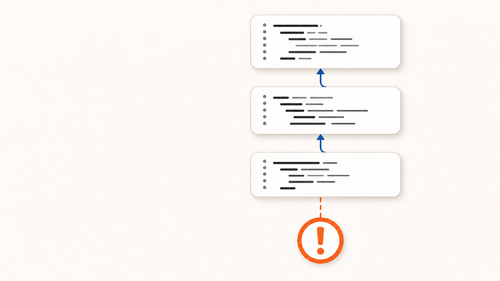
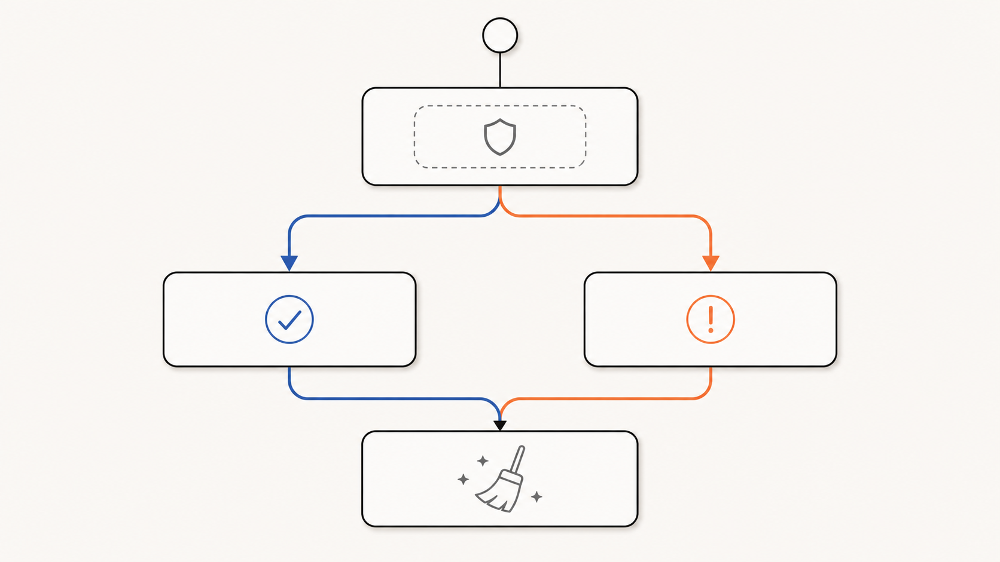
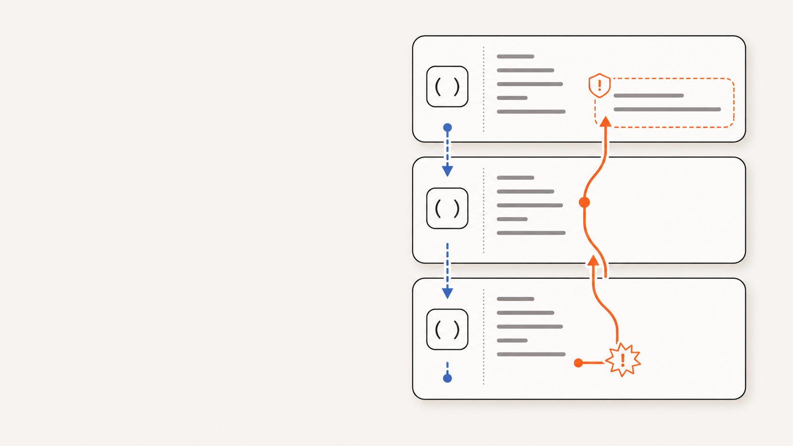

<div class="eyebrow">Python พื้นฐาน · Session 04</div>

# Errors และ Exceptions

อ่านสาเหตุ · แยก failure path · จบโปรแกรมอย่างควบคุม

---

<div class="eyebrow">Failure taxonomy</div>

# Error ไม่ได้เกิดแบบเดียว

<div class="grid3">
  <div class="card"><h3>Syntax Error</h3><p>โค้ดผิดไวยากรณ์ จึงยังเริ่มทำงานไม่ได้</p></div>
  <div class="card"><h3>Exception</h3><p>รูปแบบโค้ดถูก แต่เกิดปัญหาระหว่างทำงาน</p></div>
  <div class="card"><h3>Logic Error</h3><p>โปรแกรมทำงานจบ แต่คำตอบไม่ตรงกับที่ต้องการ</p></div>
</div>

<div class="takeaway"><p><strong>Exception</strong> คือ object ที่บอกชนิดและรายละเอียดของ failure ระหว่าง runtime</p></div>

---

<div class="eyebrow">Traceback anatomy</div>

# อ่าน Traceback จากบรรทัดล่างขึ้นบน

<div class="grid2 exception-visual">
  <div>
    <ol>
      <li><strong>Exception type</strong> — เกิดปัญหาชนิดใด</li>
      <li><strong>Message</strong> — Python รู้อะไรเกี่ยวกับปัญหา</li>
      <li><strong>Call site</strong> — เริ่มตรวจจาก frame ล่าสุด</li>
    </ol>
    <div class="takeaway"><p>แก้ที่ root cause ไม่ใช่แค่บรรทัดสุดท้ายที่เห็น</p></div>
  </div>
  
</div>

---

<div class="eyebrow">Common runtime failures</div>

# Exception ที่พบบ่อยบอกชนิดของ contract ที่พัง

<div class="grid2">
  <div class="card"><h3><code>NameError</code></h3><p>ใช้ชื่อที่ยังไม่ถูกกำหนด</p></div>
  <div class="card"><h3><code>TypeError</code></h3><p>operation ไม่รองรับชนิดข้อมูลนี้</p></div>
  <div class="card"><h3><code>ValueError</code></h3><p>ชนิดถูก แต่ค่าใช้ไม่ได้ในบริบทนั้น</p></div>
  <div class="card"><h3><code>ZeroDivisionError</code></h3><p>ตัวหารมีค่าเป็นศูนย์</p></div>
</div>

---

<div class="eyebrow">Expected failures</div>

# `try` แยก normal path ออกจาก recovery path

<div class="grid2 exception-visual">
  <div>

```python {monaco-run} {autorun:false}
text = "82.5"

try:
    score = float(text)
except ValueError:
    print("Score must be numeric")
else:
    print(f"Score: {score}")
finally:
    print("Finished")
```

  </div>
  
</div>

---

<div class="eyebrow">Specific handling</div>

# จับเฉพาะ Exception ที่จัดการได้จริง

```python {monaco-run} {autorun:false}
try:
    total = float(input("Total: "))
    people = int(input("People: "))
    share = total / people
except ValueError:
    print("Enter numeric values")
except ZeroDivisionError:
    print("People must be greater than zero")
else:
    print(f"Each person pays {share:.2f}")
```

<div class="takeaway"><p>ครอบ <code>try</code> ให้แคบ และไม่ใช้ bare <code>except</code> หรือ <code>except: pass</code></p></div>

---

<div class="eyebrow">Creating a contract</div>

# `raise` ส่งสัญญาณเมื่อข้อมูลผิดข้อตกลง

```python {monaco-run} {autorun:false}
def calculate_share(total, people):
    if total < 0:
        raise ValueError("total must be non-negative")
    if people <= 0:
        raise ValueError("people must be positive")
    return total / people

try:
    print(calculate_share(1200, 0))
except ValueError as error:
    print(f"Invalid input: {error}")
```

---

<div class="eyebrow">Program termination</div>

# ออกจาก Function หรือจบ Process?

<div class="grid2">
  <div class="card">
    <h3><code>return</code></h3>
    <p>ส่ง control กลับ caller โปรแกรมส่วนอื่นยังทำงานต่อได้</p>
  </div>
  <div class="card">
    <h3><code>sys.exit(status)</code></h3>
    <p>raise <code>SystemExit</code> เพื่อจบทั้งโปรแกรมอย่างควบคุม</p>
  </div>
</div>

```python {monaco-run} {autorun:false}
import sys

text = "not-a-number"
try:
    score = float(text)
except ValueError:
    print("Score must be numeric")
    sys.exit(1)

print(f"Score: {score}")
```

---

<div class="eyebrow">Cleanup guarantee</div>

# `finally` ยังทำงานเมื่อเกิด `SystemExit`

```python
import sys

try:
    print("Start")
    sys.exit(1)
finally:
    print("Cleanup")
```

<div class="grid2">
  <div class="card blue"><h3><code>sys.exit()</code></h3><p>เป็น <code>SystemExit</code> จึงยังผ่านกลไก cleanup ปกติ</p></div>
  <div class="card red"><h3><code>os._exit()</code></h3><p>จบ process ทันทีและข้าม <code>finally</code> — ไม่ใช้ในโปรแกรมพื้นฐาน</p></div>
</div>

---

<div class="eyebrow">Call stack</div>

# Exception เดินย้อนกลับจนพบ Handler

<div class="grid2 exception-visual">
  <div>

```python
def parse_score(text):
    return float(text)

def build_report(text):
    score = parse_score(text)
    return f"Score: {score}"

try:
    print(build_report("N/A"))
except ValueError:
    print("Report has invalid data")
```

  </div>
  
</div>

---

<div class="eyebrow">Failure-handling checklist</div>

# Handle เฉพาะสิ่งที่กู้คืนได้

<div class="grid2">
  <div class="card"><h3>Do</h3><ul><li>จับ exception แบบเฉพาะ</li><li>เก็บ normal path ให้อ่านง่าย</li><li>ให้ข้อความที่ผู้ใช้แก้ไขได้</li></ul></div>
  <div class="card red"><h3>Avoid</h3><ul><li><code>except: pass</code></li><li>ครอบทั้งโปรแกรมด้วย <code>try</code></li><li>ใช้ exception ซ่อน bug</li></ul></div>
</div>

---
layout: center
class: summary-slide
---

<div class="eyebrow">Session 04 · Recap</div>

# จาก Failure<br>สู่การกู้คืนอย่างควบคุม

<div class="summary-map">
  <div class="summary-step"><span>01</span><strong>Detect</strong><small>อ่าน traceback และจำแนก failure</small></div>
  <div class="summary-step"><span>02</span><strong>Raise</strong><small>ส่งสัญญาณเมื่อ contract พัง</small></div>
  <div class="summary-step"><span>03</span><strong>Propagate</strong><small>ย้อนผ่าน call stack ไปหา handler</small></div>
  <div class="summary-step"><span>04</span><strong>Handle</strong><small>กู้คืนหรือจบโปรแกรมอย่างชัดเจน</small></div>
</div>

<div class="summary-result"><span>MENTAL MODEL</span> <code>detect → raise → propagate → handle</code> <span class="summary-copy">= แยก failure path ออกจาก normal path</span></div>
