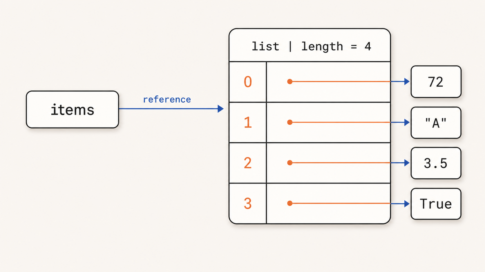
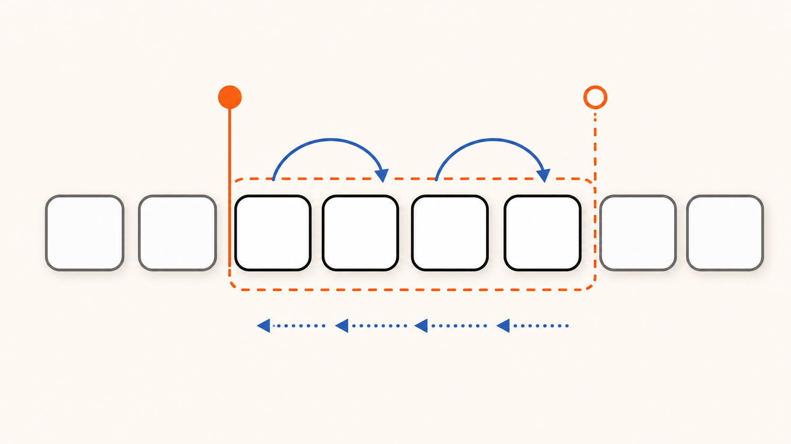
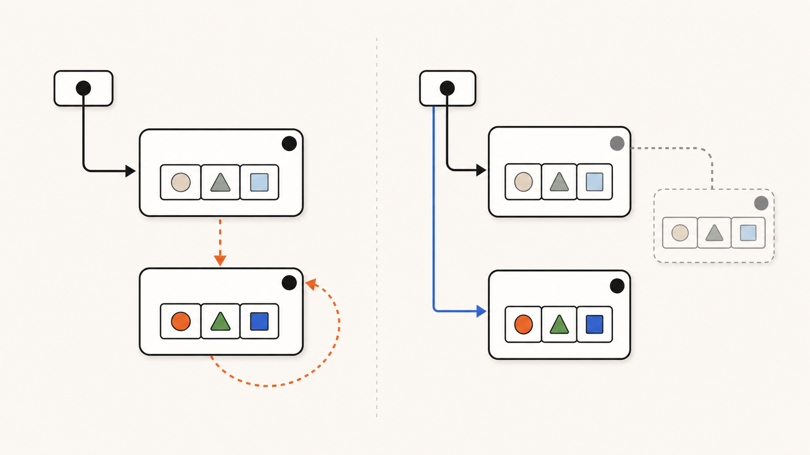
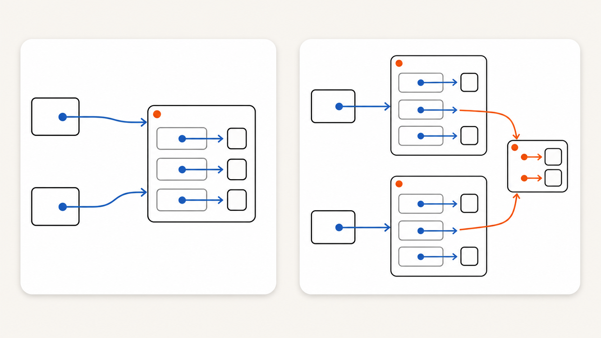

<div class="eyebrow">Python พื้นฐาน · Session 05</div>

# List และ Dictionary

เก็บหลายค่า และจัดข้อมูลให้มีโครงสร้าง

---

<div class="eyebrow">Mental model</div>

# List: Mutable Sequence

<div class="grid2 list-definition">
  <div>
    <p><strong>List</strong> คือ built-in <em>mutable sequence</em> ของ Python</p>
    <ul>
      <li><strong>Ordered:</strong> รักษาลำดับของสมาชิก</li>
      <li><strong>Zero-based indexing:</strong> ตำแหน่งแรกคือ <code>0</code></li>
      <li><strong>Mutable:</strong> เพิ่ม ลบ หรือแทนค่าสมาชิกได้</li>
      <li><strong>Heterogeneous:</strong> แต่ละ slot อ้างถึง object ต่างชนิดกันได้</li>
    </ul>
    <div class="takeaway"><p>ใน CPython: list คือ dynamic array ของ object references</p></div>
  </div>
  
</div>

---

<div class="eyebrow">Sequence</div>

# Sequence และ Indexing

<div class="grid2">
  <div class="card"><h3>Sequence</h3><p>ข้อมูลหลายค่าที่มีลำดับ เช่น <code>str</code>, <code>list</code> และ <code>tuple</code></p></div>
  <div class="card"><h3>Indexing</h3><p>การเข้าถึงสมาชิกหนึ่งค่าด้วย <code>sequence[index]</code></p></div>
</div>

```python {monaco-run} {autorun:false}
items = [10, 20, 30, 40, 50]

print(items[0])
print(items[-1])
print(items[len(items) - 1])
```

<div class="takeaway"><p>Index แรกคือ 0, index สุดท้ายคือ <code>len(items) - 1</code>, และ <code>-1</code> คือสมาชิกสุดท้าย</p></div>

---

<div class="eyebrow">Slicing definition</div>

# Slicing เลือกช่วงจาก Sequence

<div class="grid2 exception-visual">
  <div>
    <p><strong>Slicing</strong> คือการสร้าง sequence ใหม่จากช่วงที่เลือก</p>
    <div class="formula"><code>sequence[start:stop:step]</code></div>
    <ul>
      <li><strong>start</strong> รวมตำแหน่งเริ่มต้น</li>
      <li><strong>stop</strong> ไม่รวมตำแหน่งสุดท้าย</li>
      <li><strong>step</strong> ระยะและทิศทางการเดิน</li>
    </ul>
  </div>
  
</div>

---

<div class="eyebrow">Slice patterns</div>

# `[:]` · `[::2]` · `[::-1]`

```python {monaco-run} {autorun:false}
items = [0, 1, 2, 3, 4, 5, 6]

print(items[1:4])    # [1, 2, 3]
print(items[:3])     # [0, 1, 2]
print(items[3:])     # [3, 4, 5, 6]
print(items[::2])    # [0, 2, 4, 6]
print(items[1::2])   # [1, 3, 5]
print(items[::-1])   # [6, 5, 4, 3, 2, 1, 0]
```

<div class="takeaway"><p>เว้นค่าใดไว้ Python จะเลือก default จากทิศทางของ <code>step</code></p></div>

---

<div class="eyebrow">Slice behavior</div>

# Indexing กับ Slicing มี boundary ต่างกัน

<div class="grid2">
  <div>

```python
items = [10, 20, 30]

items[10]     # IndexError
```

  </div>
  <div>

```python
items = [10, 20, 30]

items[10:20]  # []
items[::0]    # ValueError
```

  </div>
</div>

<div class="takeaway"><p>Slice ที่เกินขอบเขตถูกตัดให้พอดี แต่ <code>step</code> ห้ามเป็นศูนย์</p></div>

---

<div class="eyebrow">Object properties</div>

# Mutability และ Immutability

<div class="grid2">
  <div class="card">
    <h3>Mutable</h3>
    <p>object อนุญาตให้เปลี่ยน state หลังสร้าง โดย identity เดิม</p>
    <p><code>list</code> · <code>dict</code> · <code>set</code></p>
  </div>
  <div class="card">
    <h3>Immutable</h3>
    <p>object เดิมเปลี่ยน state ไม่ได้ operation จึงให้ object ใหม่</p>
    <p><code>int</code> · <code>float</code> · <code>bool</code> · <code>str</code> · <code>tuple</code></p>
  </div>
</div>

<div class="takeaway"><p><strong>Mutation</strong> คือการเปลี่ยน object เดิม · <strong>Immutability</strong> คือคุณสมบัติที่ห้ามการเปลี่ยนนั้น</p></div>

---

<div class="eyebrow">Identity</div>

# Mutation เปลี่ยน Object · Rebinding เปลี่ยน Reference

<div class="grid2 exception-visual">
  <div>

```python {monaco-run} {autorun:false}
items = [1, 2]
before = id(items)

items.append(3)       # mutation
print(before == id(items))

items = [1, 2, 3]     # rebinding
print(before == id(items))
```

  </div>
  
</div>

---

<div class="eyebrow">Shared references</div>

# Aliasing: หลายชื่ออ้างถึง Object เดียวกัน

<div class="grid2 exception-visual">
  <div>

```python {monaco-run} {autorun:false}
a = [1, 2]
b = a
b.append(3)

print(a)       # [1, 2, 3]
print(a is b)  # True

c = a[:]
print(a is c)  # False
```

  </div>
  
</div>

---

<div class="eyebrow">Copy semantics</div>

# Shallow Copy แยก Outer แต่ยังแชร์ Nested Objects

```python {monaco-run} {autorun:false}
from copy import deepcopy

original = [["A"], ["B"]]
shallow = original[:]          # หรือ original.copy()
deep = deepcopy(original)

shallow[0].append("shared")
deep[1].append("independent")

print("original:", original)
print("shallow: ", shallow)
print("deep:    ", deep)
```

<div class="takeaway"><p>ใช้ <code>deepcopy()</code> เมื่อจำเป็นต้องแยก nested objects จริง ๆ ไม่ใช่เป็นค่าเริ่มต้นทุกครั้ง</p></div>

---

<div class="eyebrow">Function contracts</div>

# Side Effect ต้องเห็นจากชื่อและ Contract

<div class="grid2">
  <div>

```python
def add_score(scores, score):
    scores.append(score)  # mutate input
```

  </div>
  <div>

```python
def with_score(scores, score):
    return [*scores, score]  # new list
```

  </div>
</div>

<div class="card red"><h3>Mutable default pitfall</h3><p>ใช้ <code>def collect(value, items=None)</code> แล้วสร้าง list ภายใน แทน <code>items=[]</code> ที่ถูกแชร์ข้ามการเรียก</p></div>

---

<div class="eyebrow">Mutation</div>

# เพิ่ม ลบ และแก้ไขสมาชิก

```python {monaco-run} {autorun:false}
items = [10, 20, 30]
items.append(40)
items.insert(1, 15)
items.remove(30)
removed = items.pop()
items[0] = 99

print(items)
print("removed:", removed)
```

---

<div class="eyebrow">Common data work</div>

# Search · Aggregate

<div class="grid2">
  <div class="card"><h3>Search</h3><p>หา value หรือดูว่าพบหรือไม่</p></div>
  <div class="card"><h3>Aggregate</h3><p>รวมหลายค่าเป็นผลเดียว</p></div>
</div>

```python {monaco-run} {autorun:false}
scores = [72, 88, 41, 95, 67]
print(88 in scores)
print(len(scores), sum(scores), min(scores), max(scores))
```

---

<div class="eyebrow">Mapping</div>

# Dictionary เก็บข้อมูลแบบ key → value

```python {monaco-run} {autorun:false}
student = {
    "id": "S01",
    "name": "Mali",
    "score": 82,
}

print(student["name"])
print(student.get("email"))
```

<div class="grid2">
  <div class="card"><h3><code>data[key]</code></h3><p>ใช้เมื่อ key ต้องมี</p></div>
  <div class="card"><h3><code>data.get(key)</code></h3><p>ใช้เมื่อ key อาจไม่มีเป็นเรื่องปกติ</p></div>
</div>

---

<div class="eyebrow">Records</div>

# Dictionary หนึ่งตัวแทน record หนึ่งรายการ

```python
students = [
    {"id": "S01", "name": "Mali", "score": 82},
    {"id": "S02", "name": "Niran", "score": 47},
    {"id": "S03", "name": "Ploy", "score": 75},
]
```

<div class="takeaway"><p>ตกลงชื่อ fields และ type ของแต่ละ value ให้เหมือนกันทุก record</p></div>

---
layout: center
class: summary-slide
---

<div class="eyebrow">Session 05 · Recap</div>

# จากค่าหลายค่า<br>สู่ข้อมูลที่มีโครงสร้าง

<div class="summary-map">
  <div class="summary-step">
    <span>01</span><strong>Slice</strong><small>เลือกช่วงด้วย start, stop และ step</small>
  </div>
  <div class="summary-step">
    <span>02</span><strong>Identity</strong><small>แยก mutation ออกจาก rebinding</small>
  </div>
  <div class="summary-step">
    <span>03</span><strong>Copy</strong><small>เข้าใจ alias, shallow และ deep copy</small>
  </div>
  <div class="summary-step">
    <span>04</span><strong>Records</strong><small>รวม list และ dictionary เป็นข้อมูลมีโครงสร้าง</small>
  </div>
</div>

<div class="summary-result"><span>MENTAL MODEL</span> <code>list[dict]</code> <span class="summary-copy">= ชุดข้อมูลหลาย records ที่ประมวลผลต่อได้</span></div>
