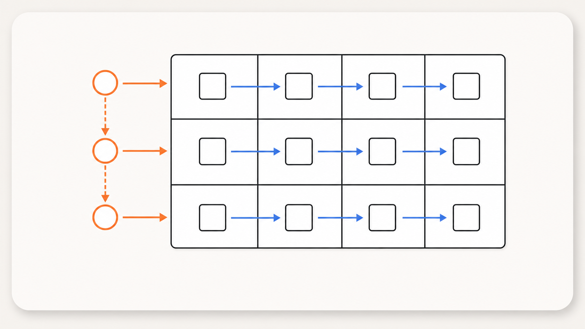

<div class="eyebrow">Python พื้นฐาน · Session 06</div>

# Loop และการประมวลผล Collection

ทำซ้ำอย่างมีจุดหยุด และเปลี่ยนข้อมูลเป็นคำตอบ

---

<div class="eyebrow">Counted repetition</div>

# `for` วนผ่านข้อมูลทีละค่า

```python {monaco-run} {autorun:false}
for number in range(1, 6):
    print(number)

for x in range(1, 6):
    print(f"{x:2} | {x**2:3} | {'#' * x}")
```

<div class="takeaway"><p><code>range(start, stop, step)</code> ไม่รวมค่า stop</p></div>

---

<div class="eyebrow">State across rounds</div>

# Accumulator และ Counter

<div class="grid2">
  <div class="card"><h3>Accumulator</h3><p>สะสมผลทีละรอบ เช่นผลรวม</p></div>
  <div class="card"><h3>Counter</h3><p>นับจำนวนสมาชิกที่ผ่านเงื่อนไข</p></div>
</div>

```python {monaco-run} {autorun:false}
total = 0
passed_count = 0
for score in [72, 88, 41, 95, 67]:
    total += score
    if score >= 50:
        passed_count += 1
print(total, passed_count)
```

---

<div class="eyebrow">Iterables</div>

# วนผ่าน String และ List

```python {monaco-run} {autorun:false}
for character in "Python":
    print(character)

for index, value in enumerate([10, 20, 30]):
    print(index, value)
```

<div class="takeaway"><p>ใช้ <code>enumerate()</code> เมื่อต้องการทั้ง index และ value</p></div>

---

<div class="eyebrow">Dictionary iteration</div>

# `.items()` ให้ทั้ง key และ value

```python {monaco-run} {autorun:false}
score_by_name = {
    "Mali": 82,
    "Niran": 47,
    "Ploy": 75,
}

for name, score in score_by_name.items():
    print(name, score)
```

---

<div class="eyebrow">Search</div>

# Linear search: พบแล้วหยุดได้

```python {monaco-run} {autorun:false}
def find(text, target):
    for index, character in enumerate(text):
        if character == target:
            return index
    return -1

print(find("Hello", "e"))
print(find("Hello", "x"))
```

<div class="takeaway"><p>ถ้าสนใจเพียงว่าพบหรือไม่ ใช้ <code>target in text</code></p></div>

---

<div class="eyebrow">Transform and filter</div>

# List comprehension

```python {monaco-run} {autorun:false}
scores = [72, 88, 41, 95, 67]
passed_scores = [score for score in scores if score >= 50]

celsius = [0, 20, 30, 100]
fahrenheit = [temp * 9 / 5 + 32 for temp in celsius]

print(passed_scores)
print(fahrenheit)
```

<div class="takeaway"><p>เหมาะเมื่อ expression และ condition สั้นพอที่จะอ่านได้ในบรรทัดเดียว</p></div>

---

<div class="eyebrow">Comprehension + aggregate</div>

# สร้างลำดับหรือรวมผลได้ตรงโจทย์

```python {monaco-run} {autorun:false}
squares = [number**2 for number in range(1, 11)]
series_total = sum(
    number**2 + 2 * number + 1
    for number in range(1, 11)
)

print(squares)
print(series_total)
```

---

<div class="eyebrow">Condition-controlled repetition</div>

# `while` วนขณะที่ condition เป็นจริง

<div class="grid3">
  <div class="card"><h3>State</h3><p>ค่าปัจจุบันที่ condition ใช้ตรวจ</p></div>
  <div class="card"><h3>Condition</h3><p>เงื่อนไขที่จะวนต่อ</p></div>
  <div class="card"><h3>Update</h3><p>ทำให้ state เข้าใกล้การหยุด</p></div>
</div>

<div class="card red"><h3>Infinite loop</h3><p>เกิดเมื่อ state ไม่เปลี่ยนไปสู่จุดหยุด; ใน terminal หยุดด้วย <code>Ctrl-C</code></p></div>

---

<div class="eyebrow">Sentinel</div>

# ค่าพิเศษสั่งให้ loop หยุด

```python {monaco-run} {autorun:false}
entries = [10, 15, 4, 8, -1]
total = 0
index = 0

while index < len(entries):
    value = entries[index]
    index += 1
    if value == -1:
        break
    total += value

print(total)
```

<div class="takeaway"><p>Sentinel ต้องไม่ชนกับค่าข้อมูลปกติที่อนุญาต</p></div>

---

<div class="eyebrow">Unknown number of attempts</div>

# `while True` เมื่อจุดหยุดอยู่ข้างใน

```python {monaco-run} {autorun:false}
while True:
    password = input("Enter password: ")
    if password == "I love Python":
        print("Correct password. Access granted.")
        break
    print("Incorrect password. Access denied.")
```

---

<div class="eyebrow">Loop control</div>

# `break` และ `continue`

<div class="grid2">
  <div class="card"><h3><code>break</code></h3><p>ออกจาก loop ชั้นปัจจุบันทันที</p></div>
  <div class="card"><h3><code>continue</code></h3><p>ข้ามส่วนที่เหลือของรอบปัจจุบัน</p></div>
</div>

<div class="takeaway"><p>ใน <code>while</code> อย่าให้ continue ข้าม update ที่จำเป็นต่อการหยุด</p></div>

---

<div class="eyebrow">Nested loops</div>

# Outer loop เป็นแถว · Inner loop เป็นคอลัมน์

<div class="grid2 nested-loop-definition">
  <div>

```python {monaco-run} {autorun:false}
for row in range(1, 4):
    line = ""
    for column in range(1, 5):
        line += f"{row * column:3}"
    print(line)
```

<div class="loop-legend">
  <span class="outer-loop">Outer</span> เปลี่ยนแถว
  <span class="inner-loop">Inner</span> เดินทุกคอลัมน์
</div>

  </div>
  
</div>

<div class="takeaway"><p>Inner loop ทำงานครบทุกคอลัมน์ ก่อน Outer loop เปลี่ยนไปแถวถัดไป</p></div>

---

<div class="eyebrow">Putting it together</div>

# สรุปคะแนน

```python {monaco-run} {autorun:false}
scores = [72, 88, 41, 95, 67]
total = 0
passed_count = 0

for score in scores:
    total += score
    if score >= 50:
        passed_count += 1

average = total / len(scores) if scores else None
print(f"Average: {average:.1f}")
print(f"Passed: {passed_count}")
```

---

<div class="eyebrow">Collection processing</div>

# ประมวลผลข้อมูลนักเรียน

```python {monaco-run} {autorun:false}
students = [
    {"id": "S01", "name": "Mali", "score": 82},
    {"id": "S02", "name": "Niran", "score": 47},
    {"id": "S03", "name": "Ploy", "score": 75},
]

passed_names = [
    student["name"]
    for student in students
    if student["score"] >= 50
]
score_by_id = {
    student["id"]: student["score"]
    for student in students
}

print(passed_names)
print(score_by_id)
```

---
layout: center
class: summary-slide
---

<div class="eyebrow">Session 06 · Recap</div>

# จากข้อมูลหลายรายการ<br>สู่คำตอบที่คำนวณได้

<div class="summary-map">
  <div class="summary-step">
    <span>01</span><strong><code>for</code></strong><small>ทำงานกับสมาชิกทีละรายการ</small>
  </div>
  <div class="summary-step">
    <span>02</span><strong><code>while</code></strong><small>ทำซ้ำตราบใดที่เงื่อนไขยังจริง</small>
  </div>
  <div class="summary-step">
    <span>03</span><strong>Transform</strong><small>กรองหรือแปลง collection</small>
  </div>
  <div class="summary-step">
    <span>04</span><strong>Aggregate</strong><small>สรุปหลายค่าเป็นผลลัพธ์เดียว</small>
</div>
</div>

<div class="summary-result"><span>MENTAL MODEL</span> <code>collection → loop → result</code> <span class="summary-copy">= ประมวลผลข้อมูลด้วยกฎเดียวกันอย่างเป็นระบบ</span></div>
